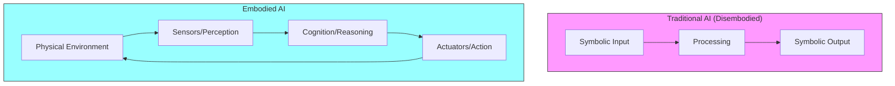
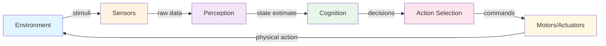
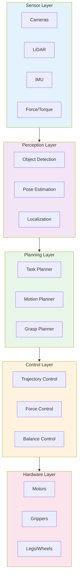

# Chapter 1: Foundations of Physical AI & Embodied Intelligence

## Learning Objectives

By the end of this chapter, you will be able to:

- Define Physical AI and explain how it differs from traditional software-based AI
- Describe the concept of embodied intelligence and its importance in robotics
- Explain the perception-action loop and its role in autonomous systems
- Identify the key components of a Physical AI system architecture
- Understand the challenges unique to AI systems that interact with the physical world
- Recognize the role of simulation in developing Physical AI systems

---

## 1. Introduction to Physical AI

**Physical AI** represents a paradigm shift in artificial intelligence—moving from systems that exist purely in the digital realm to intelligent agents that perceive, reason about, and act within the physical world. Unlike traditional AI systems that process text, images, or structured data in isolation, Physical AI must contend with the messy, unpredictable, and continuous nature of physical reality.

The term encompasses a broad range of technologies, from autonomous vehicles navigating city streets to humanoid robots performing household tasks. What unites these systems is their need to bridge the gap between abstract computation and concrete physical action.

### Why Physical AI Matters Now

Several converging trends have made Physical AI increasingly viable:

1. **Advances in deep learning** have dramatically improved perception capabilities
2. **GPU computing** enables real-time processing of sensor data
3. **Improved simulation tools** allow safe, scalable training
4. **Foundation models** provide generalizable reasoning capabilities
5. **Hardware miniaturization** makes capable robots more practical

Physical AI is not merely robotics with better algorithms—it represents a fundamental rethinking of how intelligent systems should be designed when they must operate in and interact with the real world.

---

## 2. Embodied Intelligence

**Embodied intelligence** is the principle that true intelligence cannot be separated from having a physical body that interacts with an environment. This concept, rooted in cognitive science and philosophy, has profound implications for how we design AI systems.

### The Embodiment Hypothesis

Traditional AI often treats intelligence as purely computational—a disembodied mind processing abstract symbols. The embodiment hypothesis challenges this view, arguing that:

- **Intelligence emerges from interaction**: Cognitive capabilities develop through continuous interaction with the environment
- **The body shapes the mind**: Physical form constrains and enables certain types of reasoning
- **Grounding requires experience**: Abstract concepts gain meaning through sensorimotor experience

### Implications for Robotics

For roboticists, embodied intelligence means:

- **Sensor-motor coupling**: Perception and action must be tightly integrated
- **Real-time constraints**: The world does not wait; responses must be timely
- **Physical grounding**: All knowledge must ultimately connect to physical experience
- **Morphological computation**: The body itself can perform computation through its structure

---

## 3. The Perception-Action Loop

At the heart of every Physical AI system lies the **perception-action loop**—the continuous cycle through which an agent senses its environment, processes that information, decides on actions, and executes them.

### Components of the Loop

1. **Sensors**: Cameras, LiDAR, IMUs, force sensors, and other devices that capture information about the environment and the robot's own state

2. **Perception**: Processing raw sensor data into meaningful representations—detecting objects, estimating poses, recognizing scenes

3. **Cognition**: Higher-level reasoning about goals, planning sequences of actions, and making decisions under uncertainty

4. **Action Selection**: Choosing specific motor commands or behaviors based on cognitive decisions

5. **Actuators**: Motors, servos, and other devices that produce physical movement

6. **Environment**: The physical world that is affected by the robot's actions and produces new sensory stimuli

### Timing and Latency

The perception-action loop must operate at speeds appropriate to the task:

| Task Type | Typical Loop Rate | Latency Tolerance |
|-----------|-------------------|-------------------|
| Manipulation | 100-1000 Hz | 1-10 ms |
| Navigation | 10-100 Hz | 10-100 ms |
| High-level planning | 1-10 Hz | 100 ms - 1 s |

Failing to meet timing requirements can result in instability, poor performance, or safety hazards.

---

## 4. Key Components of Physical AI Systems

A complete Physical AI system integrates multiple subsystems, each with its own challenges and design considerations.

### 4.1 Sensing and Perception

Physical AI systems typically employ multiple sensor modalities:

- **Vision**: RGB cameras, depth cameras (RGB-D), stereo vision
- **Range sensing**: LiDAR, ultrasonic sensors, radar
- **Proprioception**: Joint encoders, IMUs, force/torque sensors
- **Tactile sensing**: Pressure arrays, slip detection, texture sensing

Perception algorithms transform this raw data into actionable information:

- **Object detection and recognition**: Identifying what is in the scene
- **Pose estimation**: Determining the position and orientation of objects
- **Scene understanding**: Building semantic representations of the environment
- **State estimation**: Tracking the robot's own position and configuration

### 4.2 Planning and Decision Making

Once the environment is perceived, the system must decide what to do:

- **Task planning**: Decomposing high-level goals into sequences of actions
- **Motion planning**: Computing collision-free paths through space
- **Grasp planning**: Determining how to pick up and manipulate objects
- **Reactive control**: Responding quickly to unexpected events

### 4.3 Control and Actuation

Executing plans requires precise control of physical hardware:

- **Trajectory tracking**: Following planned paths accurately
- **Force control**: Regulating contact forces during manipulation
- **Balance control**: Maintaining stability for legged robots
- **Compliance**: Adapting to unexpected contacts safely

### 4.4 System Architecture

---

## 5. Challenges in Physical AI

Developing Physical AI systems presents unique challenges not found in traditional software development.

### 5.1 The Reality Gap

Algorithms developed in simulation often fail when deployed on real hardware. This **reality gap** arises from:

- **Sensor noise**: Real sensors are noisy and imperfect
- **Model inaccuracies**: Physics simulations never perfectly match reality
- **Unmodeled dynamics**: Real systems have effects not captured in models
- **Environmental variation**: The real world is more diverse than any simulation

Bridging this gap requires techniques like domain randomization, sim-to-real transfer, and robust control.

### 5.2 Safety and Reliability

Physical AI systems can cause real-world harm:

- **Collision avoidance**: Preventing contact with people and obstacles
- **Graceful degradation**: Failing safely when components malfunction
- **Predictability**: Ensuring behavior is understandable to humans
- **Verification**: Proving system properties mathematically where possible

### 5.3 Real-Time Constraints

Unlike web services that can take seconds to respond, Physical AI must:

- Process sensor data in milliseconds
- Execute control loops at hundreds of hertz
- Coordinate multiple subsystems with tight timing
- Handle computational resource limitations

### 5.4 Integration Complexity

Physical AI systems are inherently complex:

- **Hardware-software integration**: Dealing with drivers, communication protocols, and timing
- **Multi-modal fusion**: Combining information from diverse sensors
- **Distributed computation**: Spreading work across multiple processors
- **System calibration**: Ensuring all components are properly aligned and configured

---

## 6. The Role of Simulation

Simulation has become indispensable for Physical AI development, enabling:

### 6.1 Safe Experimentation

Testing dangerous maneuvers, failure modes, and edge cases without risking hardware or humans.

### 6.2 Scalable Data Generation

Generating vast amounts of training data for machine learning far faster than real-world collection.

### 6.3 Rapid Iteration

Testing algorithm changes in minutes rather than days required for physical experiments.

### 6.4 Sim-to-Real Transfer

Modern techniques enable policies learned in simulation to transfer to real robots:

- **Domain randomization**: Varying simulation parameters to improve robustness
- **System identification**: Tuning simulation to match real hardware
- **Progressive training**: Gradually transitioning from simulation to reality

---

## 7. Experimental / Evolving Concepts

The following topics represent active areas of research where best practices are still emerging:

### 7.1 Foundation Models for Robotics

Large language models (LLMs) and vision-language models (VLMs) are being adapted for robotics:

- **Task specification**: Using natural language to define robot goals
- **Commonsense reasoning**: Leveraging world knowledge for planning
- **Few-shot learning**: Adapting to new tasks with minimal examples

This area is evolving rapidly, and best practices are not yet established.

### 7.2 End-to-End Learning

Training systems that map directly from sensors to actions:

- **Imitation learning**: Learning from human demonstrations
- **Reinforcement learning**: Learning through trial and error
- **Hybrid approaches**: Combining learning with traditional methods

### 7.3 Human-Robot Interaction

As robots enter human spaces, interaction becomes critical:

- **Intent recognition**: Understanding what humans want
- **Natural communication**: Speech, gesture, and other modalities
- **Shared autonomy**: Humans and robots collaborating on tasks

---

## 8. Summary and Key Takeaways

Physical AI represents the next frontier of artificial intelligence—systems that don't just think, but act in the physical world. Key concepts from this chapter include:

1. **Physical AI** bridges computation and physical action, requiring systems that can perceive, reason, and act in real-time

2. **Embodied intelligence** recognizes that true intelligence emerges from physical interaction with the environment

3. **The perception-action loop** is the fundamental cycle through which Physical AI systems operate

4. **System architecture** must integrate sensors, perception, planning, control, and hardware into a coherent whole

5. **Unique challenges** include the reality gap, safety requirements, real-time constraints, and integration complexity

6. **Simulation** is essential for safe development, data generation, and algorithm testing

As you continue through this textbook, these foundational concepts will underpin your understanding of more specific topics like ROS 2, simulation tools, and vision-language-action systems.

---

## Further Reading

- Pfeifer, R., & Bongard, J. (2006). *How the Body Shapes the Way We Think: A New View of Intelligence*. MIT Press.
- Brooks, R. A. (1991). "Intelligence without representation." *Artificial Intelligence*, 47(1-3), 139-159.
- Khatib, O. (1987). "A unified approach for motion and force control of robot manipulators." *IEEE Journal on Robotics and Automation*, 3(1), 43-53.
- Tobin, J., et al. (2017). "Domain Randomization for Transferring Deep Neural Networks from Simulation to the Real World." *IROS 2017*.
- NVIDIA Isaac Platform Documentation: https://developer.nvidia.com/isaac
