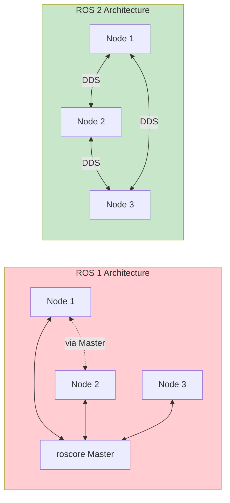
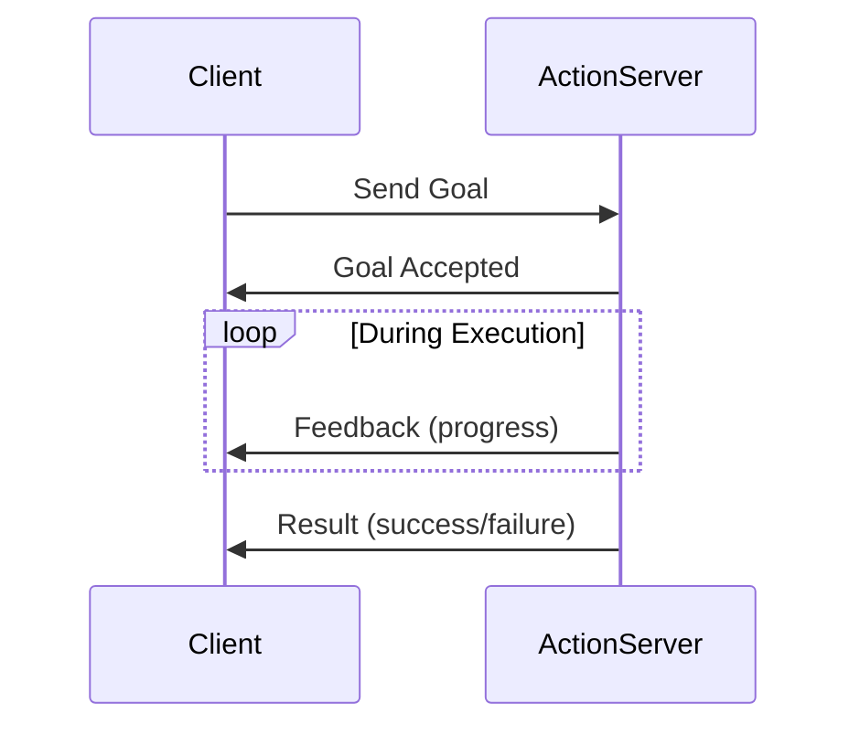
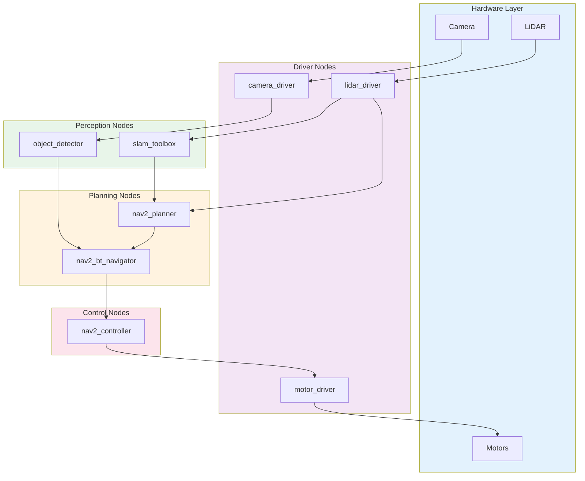

# Chapter 2: ROS 2 & Robotics System Architecture

## Learning Objectives

By the end of this chapter, you will be able to:

- Explain the purpose and architecture of ROS 2 (Robot Operating System 2)
- Describe the publish-subscribe communication pattern and its benefits for robotics
- Understand nodes, topics, services, and actions as core ROS 2 concepts
- Explain why ROS 2 was developed as a successor to ROS 1
- Identify common ROS 2 packages and their roles in robot systems
- Describe how ROS 2 enables modular, distributed robotics architectures

---

## 1. Introduction to ROS 2

**ROS 2** (Robot Operating System 2) is not actually an operating system—it is a flexible framework for writing robot software. ROS 2 provides a collection of tools, libraries, and conventions that aim to simplify the task of creating complex and robust robot behavior across a wide variety of robotic platforms.

### What ROS 2 Provides

ROS 2 offers:

- **Communication infrastructure**: Standardized ways for components to exchange data
- **Hardware abstraction**: Interfaces that hide hardware-specific details
- **Device drivers**: Ready-made interfaces for common sensors and actuators
- **Libraries**: Implementations of common robotics algorithms
- **Tools**: Visualization, debugging, and development utilities
- **Package management**: A system for sharing and reusing code

### Why "Robot Operating System"?

Despite its name, ROS 2 runs on top of a conventional operating system (typically Ubuntu Linux). The "operating system" label reflects its role as a middleware layer that provides OS-like services—process management, inter-process communication, and hardware abstraction—specifically designed for robotics applications.

---

## 2. The Evolution from ROS 1 to ROS 2

ROS 1 was developed starting in 2007 and became the dominant framework for robotics research. However, several limitations motivated the development of ROS 2:

### Limitations of ROS 1

| Limitation | Impact |
|------------|--------|
| Single point of failure (roscore) | Entire system fails if master crashes |
| No real-time support | Cannot guarantee timing for safety-critical systems |
| Limited security | No encryption or authentication |
| Designed for single robot | Difficult to scale to multi-robot systems |
| Linux-only in practice | Limited cross-platform support |

### ROS 2 Improvements



ROS 2 addresses these limitations through:

1. **Decentralized architecture**: No single master; nodes discover each other automatically
2. **Real-time support**: Designed to work with real-time operating systems
3. **Built-in security**: DDS-based security for encryption and authentication
4. **Multi-robot ready**: Better support for distributed systems
5. **Cross-platform**: Native support for Linux, Windows, and macOS

---

## 3. Core Concepts: Nodes, Topics, and Messages

### 3.1 Nodes

A **node** is the fundamental unit of computation in ROS 2. Each node is a process that performs a specific task—reading a sensor, controlling a motor, planning a path, etc.

Nodes should be:
- **Single-purpose**: Each node does one thing well
- **Reusable**: Designed to work in different contexts
- **Loosely coupled**: Minimal dependencies on other nodes

Example nodes in a mobile robot system:
- `camera_driver`: Interfaces with camera hardware
- `object_detector`: Processes images to find objects
- `path_planner`: Computes navigation paths
- `motor_controller`: Sends commands to wheel motors

### 3.2 Topics

**Topics** are named buses over which nodes exchange messages. Topics implement a publish-subscribe pattern:

- **Publishers** send messages to a topic
- **Subscribers** receive messages from a topic
- Publishers and subscribers are decoupled—they don't know about each other

```mermaid
flowchart LR
    subgraph Publishers
        P1[Camera Node]
        P2[LiDAR Node]
    end

    subgraph Topics
        T1[/camera/image]
        T2[/lidar/scan]
        T3[/cmd_vel]
    end

    subgraph Subscribers
        S1[Perception Node]
        S2[Navigation Node]
        S3[Motor Controller]
    end

    P1 -->|publish| T1
    P2 -->|publish| T2
    T1 -->|subscribe| S1
    T2 -->|subscribe| S1
    T2 -->|subscribe| S2
    S2 -->|publish| T3
    T3 -->|subscribe| S3

    style Topics fill:#fff9c4
```

### 3.3 Messages

**Messages** are the data structures exchanged over topics. ROS 2 provides standard message types and allows custom definitions.

Common standard messages:
- `sensor_msgs/Image`: Camera images
- `sensor_msgs/LaserScan`: LiDAR data
- `geometry_msgs/Twist`: Velocity commands
- `geometry_msgs/Pose`: Position and orientation
- `nav_msgs/Odometry`: Robot position from wheel encoders

---

## 4. Services and Actions

While topics are ideal for continuous data streams, ROS 2 provides other patterns for different interaction types.

### 4.1 Services

**Services** implement a request-response pattern for synchronous operations:

- Client sends a request
- Server processes the request
- Server sends a response

Use services when you need a one-time operation with a result, such as:
- Capturing a single image
- Computing a path
- Changing a parameter

```python
# Conceptual service call example
response = path_planning_client.call(
    start=current_pose,
    goal=target_pose
)
path = response.path
```

### 4.2 Actions

**Actions** are for long-running tasks that need feedback and cancellation:

- Client sends a goal
- Server works on the goal, providing periodic feedback
- Server sends a result when complete
- Client can cancel the goal at any time

Use actions for tasks like:
- Navigating to a waypoint
- Picking up an object
- Executing a complex motion



---

## 5. Quality of Service (QoS)

ROS 2 introduces **Quality of Service** policies that control how messages are delivered. QoS allows you to tune communication for different requirements.

### Key QoS Parameters

| Parameter | Options | Use Case |
|-----------|---------|----------|
| **Reliability** | Best effort / Reliable | Sensor data vs. commands |
| **Durability** | Volatile / Transient local | Whether late subscribers get old messages |
| **History** | Keep last N / Keep all | How many messages to buffer |
| **Deadline** | Time limit | Real-time requirements |

### Example Configurations

**Sensor data** (high frequency, some loss acceptable):
```python
qos_sensor = QoSProfile(
    reliability=ReliabilityPolicy.BEST_EFFORT,
    history=HistoryPolicy.KEEP_LAST,
    depth=10
)
```

**Commands** (must be delivered):
```python
qos_command = QoSProfile(
    reliability=ReliabilityPolicy.RELIABLE,
    history=HistoryPolicy.KEEP_LAST,
    depth=1
)
```

---

## 6. Common ROS 2 Packages and Tools

The ROS 2 ecosystem includes thousands of packages. Here are essential ones for Physical AI development:

### 6.1 Navigation (Nav2)

The Navigation2 stack provides autonomous navigation:
- Path planning (global and local)
- Obstacle avoidance
- Localization (AMCL)
- Behavior trees for complex navigation logic

### 6.2 MoveIt 2

MoveIt 2 handles motion planning for robot arms:
- Inverse kinematics
- Collision-aware path planning
- Grasp planning
- Integration with perception

### 6.3 Perception Packages

- `image_pipeline`: Image processing and camera calibration
- `pcl_ros`: Point cloud processing
- `vision_opencv`: OpenCV integration

### 6.4 Development Tools

- **RViz2**: 3D visualization of robot state and sensor data
- **rqt**: Qt-based tools for plotting, logging, and debugging
- **ros2 bag**: Recording and playback of message data
- **launch**: System startup and configuration

### System Architecture Example



---

## 7. Building a ROS 2 System

### 7.1 Workspace Structure

A typical ROS 2 workspace:

```
ros2_ws/
├── src/
│   ├── my_robot_description/    # URDF and meshes
│   ├── my_robot_bringup/        # Launch files
│   ├── my_robot_perception/     # Perception nodes
│   └── my_robot_navigation/     # Navigation config
├── build/                       # Build artifacts
├── install/                     # Installed packages
└── log/                         # Build logs
```

### 7.2 Package Organization

Each package should have:
- Clear single responsibility
- Documented interfaces (topics, services, actions)
- Configuration through parameters
- Launch files for easy startup

### 7.3 Launch System

ROS 2 launch files orchestrate bringing up multiple nodes:

```python
# Conceptual launch file structure
def generate_launch_description():
    return LaunchDescription([
        Node(
            package='my_robot_perception',
            executable='object_detector',
            parameters=[config_file]
        ),
        Node(
            package='nav2_planner',
            executable='planner_server',
            parameters=[nav_params]
        ),
        # ... more nodes
    ])
```

---

## 8. Experimental / Evolving Concepts

### 8.1 ROS 2 and Real-Time

ROS 2's real-time capabilities are still maturing:
- Requires careful node design
- Needs real-time OS (RT-Linux)
- Memory management must be deterministic
- Some packages not yet real-time safe

### 8.2 ROS 2 on Edge Devices

Running ROS 2 on resource-constrained hardware:
- Micro-ROS for microcontrollers
- Optimized DDS implementations
- Trade-offs between functionality and resources

### 8.3 Cloud Robotics Integration

Connecting ROS 2 robots to cloud services:
- Fog computing architectures
- Cloud-based AI inference
- Fleet management systems

---

## 9. Summary and Key Takeaways

ROS 2 provides the foundational infrastructure for building Physical AI systems:

1. **ROS 2 is middleware**, not an OS—it provides communication, tools, and libraries for robot software

2. **Nodes are the building blocks**—each performs a specific function and communicates through well-defined interfaces

3. **Topics, services, and actions** provide different communication patterns for different needs

4. **Quality of Service** allows tuning communication for reliability, latency, and resource usage

5. **Rich ecosystem** of packages provides ready-made solutions for navigation, manipulation, perception, and more

6. **Decentralized architecture** eliminates single points of failure and enables distributed systems

Understanding ROS 2 is essential for modern robotics development, as it has become the de facto standard for research and increasingly for commercial applications.

---

## Further Reading

- ROS 2 Documentation: https://docs.ros.org/
- Navigation2 Documentation: https://navigation.ros.org/
- MoveIt 2 Documentation: https://moveit.ros.org/
- Macenski, S., et al. (2022). "Robot Operating System 2: Design, Architecture, and Uses In The Wild." *Science Robotics*.
- Open Robotics: https://www.openrobotics.org/
