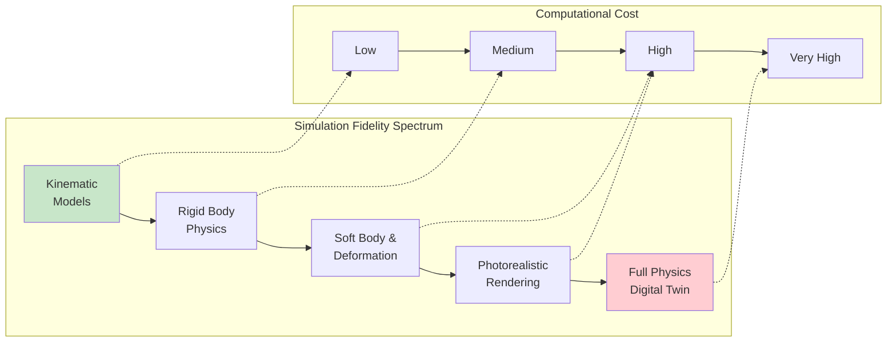
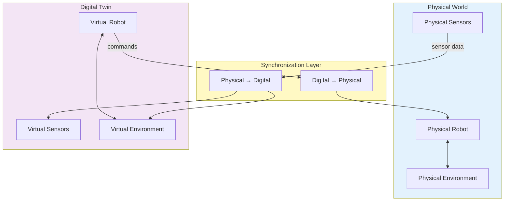
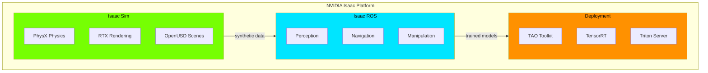
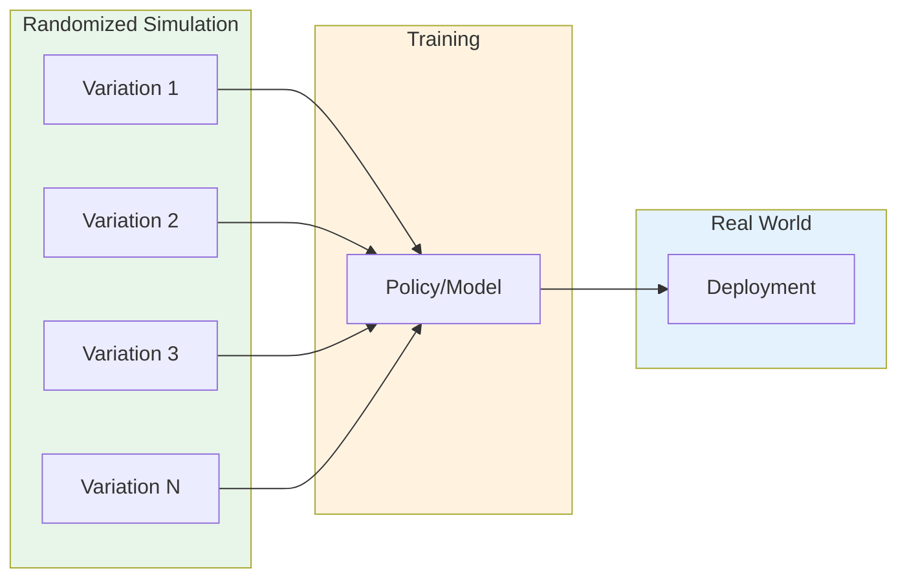

# Chapter 3: Simulation, Digital Twins & NVIDIA Isaac

## Learning Objectives

By the end of this chapter, you will be able to:

- Explain why simulation is essential for Physical AI development
- Define digital twins and describe their role in robotics
- Identify the key components of a robotics simulation system
- Describe the NVIDIA Isaac platform and its major tools
- Understand sim-to-real transfer and the techniques used to bridge the reality gap
- Recognize the trade-offs between simulation fidelity and computational cost

---

## 1. The Role of Simulation in Robotics

Simulation has become indispensable for developing Physical AI systems. Before deploying algorithms on real hardware—where mistakes are costly, time-consuming, and potentially dangerous—engineers validate their systems in virtual environments.

### Why Simulate?

| Benefit | Description |
|---------|-------------|
| **Safety** | Test dangerous scenarios without risk to hardware or humans |
| **Speed** | Run experiments faster than real-time; parallelize across GPUs |
| **Cost** | No hardware wear, no physical lab space required |
| **Repeatability** | Perfect reproducibility of experiments |
| **Scale** | Generate millions of training examples |
| **Edge cases** | Test rare scenarios that seldom occur naturally |

### The Simulation Spectrum

Simulations range from simple to highly realistic:

Higher fidelity enables better transfer to reality but requires more computational resources. The art of simulation is choosing the right level of fidelity for each application.

---

## 2. Physics Simulation Fundamentals

At the core of any robotics simulator is a **physics engine** that computes how objects move and interact.

### 2.1 Rigid Body Dynamics

Most robotics simulators model the world as collections of **rigid bodies**—objects that don't deform under forces. The physics engine must compute:

- **Forward dynamics**: Given forces, compute accelerations and motion
- **Collision detection**: Determine when objects intersect
- **Contact resolution**: Compute forces that prevent interpenetration
- **Constraint solving**: Enforce joint limits, motors, and other constraints

### 2.2 Key Physics Concepts

**Joints** connect rigid bodies and constrain their relative motion:
- Revolute (hinge): One rotational degree of freedom
- Prismatic (slider): One translational degree of freedom
- Ball (spherical): Three rotational degrees of freedom
- Fixed: No relative motion

**Contact models** determine how objects interact when they touch:
- Friction (Coulomb model)
- Restitution (bounciness)
- Soft contacts vs. rigid contacts

### 2.3 Common Physics Engines

| Engine | Strengths | Use Cases |
|--------|-----------|-----------|
| **PhysX** | GPU acceleration, stability | NVIDIA Isaac, games |
| **Bullet** | Open source, widely used | Robotics research |
| **MuJoCo** | Accuracy, speed, soft contacts | Reinforcement learning |
| **DART** | Analytical derivatives | Optimization-based control |
| **ODE** | Mature, simple API | Legacy systems |

---

## 3. Digital Twins

A **digital twin** is a virtual replica of a physical system that mirrors its real-world counterpart in real-time. Unlike simple simulations, digital twins maintain a bidirectional connection with reality.

### 3.1 Digital Twin Architecture

### 3.2 Digital Twin Applications

**Design and validation**: Test robot designs virtually before manufacturing

**Predictive maintenance**: Monitor real robots through their digital counterparts; predict failures before they occur

**Training and optimization**: Train AI policies on the digital twin; transfer to the physical robot

**Remote operation**: Operators interact with the digital twin; commands are relayed to the physical system

**What-if analysis**: Test modifications in simulation before deploying to hardware

### 3.3 Levels of Digital Twin Maturity

1. **Descriptive**: Static 3D model for visualization
2. **Informative**: Model connected to real-time sensor data
3. **Predictive**: Model can forecast future states
4. **Prescriptive**: Model recommends actions
5. **Autonomous**: Model makes decisions and actuates the physical system

---

## 4. NVIDIA Isaac Platform

**NVIDIA Isaac** is a comprehensive platform for developing and deploying AI-powered robots. It provides tools spanning the entire robotics development workflow.

### 4.1 Isaac Platform Components

### 4.2 Isaac Sim

**Isaac Sim** is NVIDIA's robotics simulation platform built on **NVIDIA Omniverse**. Key features include:

- **PhysX 5**: GPU-accelerated physics with accurate contact modeling
- **RTX rendering**: Photorealistic images using ray tracing
- **OpenUSD**: Universal Scene Description for interoperable 3D assets
- **Domain randomization**: Automated variation of simulation parameters
- **Synthetic data generation**: Automatic labeling for training perception models
- **ROS/ROS 2 bridge**: Seamless integration with ROS-based systems

### 4.3 Isaac ROS

**Isaac ROS** provides GPU-accelerated ROS 2 packages:

- **Isaac ROS Visual SLAM**: Real-time localization and mapping
- **Isaac ROS Object Detection**: DNN-based object detection
- **Isaac ROS DNN Inference**: Optimized neural network execution
- **Isaac ROS Nvblox**: 3D reconstruction for navigation
- **Isaac ROS Depth Segmentation**: Depth-based scene understanding

### 4.4 Isaac for Deployment

NVIDIA provides tools for deploying trained models:

- **TAO Toolkit**: Train and fine-tune perception models
- **TensorRT**: Optimize models for NVIDIA GPUs
- **Triton Inference Server**: Serve models at scale
- **Isaac AMR**: Application framework for autonomous mobile robots

---

## 5. Sim-to-Real Transfer

The ultimate goal of simulation is to produce systems that work in reality. **Sim-to-real transfer** refers to the techniques used to bridge the gap between simulated and real-world performance.

### 5.1 The Reality Gap

Simulations differ from reality in many ways:

- **Visual differences**: Simulated images look different from camera images
- **Physics differences**: Real contact, friction, and dynamics are imperfect
- **Sensor noise**: Real sensors have noise patterns not captured in simulation
- **Unmodeled effects**: Wind, temperature, wear, and other factors
- **Timing differences**: Real-time constraints differ from simulation time

### 5.2 Domain Randomization

**Domain randomization** trains models on a wide distribution of simulated conditions, hoping that reality falls within that distribution.

Randomized parameters include:
- Lighting (intensity, color, direction)
- Textures and colors
- Object positions and orientations
- Physics parameters (friction, mass)
- Sensor noise
- Camera properties

### 5.3 System Identification

**System identification** tunes simulation parameters to match real-world behavior:

1. Collect data from the real system
2. Run the same commands in simulation
3. Measure discrepancies
4. Adjust simulation parameters
5. Repeat until simulation matches reality

### 5.4 Progressive Training

Start training in simple simulations and progressively increase complexity:

1. Begin with ideal physics, no noise
2. Add sensor noise
3. Add physics variations
4. Add visual variations
5. Fine-tune on real data (if available)

---

## 6. Synthetic Data Generation

Simulation enables generating vast amounts of labeled training data—**synthetic data**—for perception models.

### 6.1 Advantages of Synthetic Data

- **Perfect labels**: Ground truth is known exactly
- **Unlimited scale**: Generate millions of examples
- **Rare scenarios**: Create edge cases on demand
- **Privacy**: No real personal data involved
- **Cost**: Cheaper than manual annotation

### 6.2 Synthetic Data Pipeline

1. **Scene generation**: Programmatically create varied scenes
2. **Rendering**: Produce images with RTX or rasterization
3. **Annotation**: Automatically extract labels from scene graph
4. **Export**: Save in standard formats (COCO, KITTI, etc.)
5. **Training**: Train models on synthetic data
6. **Validation**: Test on real data to verify transfer

### 6.3 Closing the Synthetic-Real Gap

Techniques to improve synthetic data quality:

- **Photorealistic rendering**: Use ray tracing for accurate lighting
- **Real-world assets**: Scan real objects for 3D models
- **Domain adaptation**: Fine-tune on small amounts of real data
- **Style transfer**: Make synthetic images look more realistic

---

## 7. Building a Simulation Workflow

### 7.1 Workflow Overview

A typical simulation-based development workflow:

1. **Model creation**: Build robot URDF/USD and environment models
2. **Scenario design**: Define tasks, initial conditions, success criteria
3. **Training**: Use simulation for policy learning or data generation
4. **Validation**: Test in increasingly realistic simulations
5. **Hardware deployment**: Transfer to real robot
6. **Iteration**: Use real-world feedback to improve simulation

### 7.2 Best Practices

- **Version control**: Track simulation configurations and results
- **Automated pipelines**: Script experiments for reproducibility
- **Metrics tracking**: Log performance across simulation and reality
- **Graceful degradation**: Design systems that fail safely when sim-to-real gap appears
- **Continuous validation**: Regularly compare simulation to reality

---

## 8. Experimental / Evolving Concepts

### 8.1 Neural Physics

Using neural networks to learn physics models from data:
- Can capture complex dynamics that analytical models miss
- Requires large amounts of real-world data
- Generalization remains challenging

### 8.2 Generative World Models

AI systems that can imagine future states:
- Video prediction models
- World models for planning
- Foundation models for simulation

### 8.3 Real-Time Digital Twins

Fully synchronized twins operating at real-time or faster:
- Requires edge computing
- Enables predictive control
- Active research area for industrial applications

---

## 9. Summary and Key Takeaways

Simulation and digital twins are foundational technologies for Physical AI:

1. **Simulation enables safe, fast, scalable development** before deploying to real hardware

2. **Physics engines** model rigid body dynamics, collisions, and constraints

3. **Digital twins** maintain a live connection between virtual and physical systems

4. **NVIDIA Isaac** provides a comprehensive platform spanning simulation, perception, and deployment

5. **Sim-to-real transfer** bridges the reality gap through domain randomization, system identification, and progressive training

6. **Synthetic data** provides unlimited, perfectly labeled training examples for perception models

7. **The simulation workflow** integrates modeling, training, validation, and deployment into a continuous loop

Mastering simulation tools and techniques is essential for modern robotics development, enabling rapid iteration and safer deployment of Physical AI systems.

---

## Further Reading

- NVIDIA Isaac Sim Documentation: https://developer.nvidia.com/isaac-sim
- NVIDIA Omniverse: https://www.nvidia.com/en-us/omniverse/
- Tobin, J., et al. (2017). "Domain Randomization for Transferring Deep Neural Networks from Simulation to the Real World." *IROS 2017*.
- Collins, J., et al. (2021). "A Review of Physics Simulators for Robotic Applications." *IEEE Access*.
- OpenUSD: https://openusd.org/
