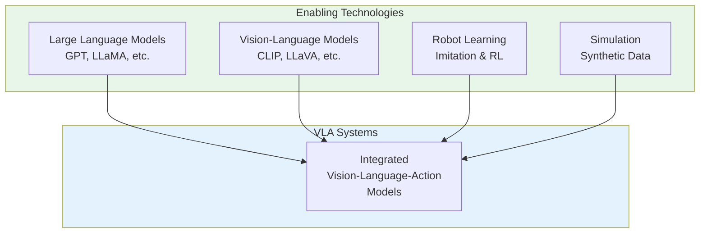
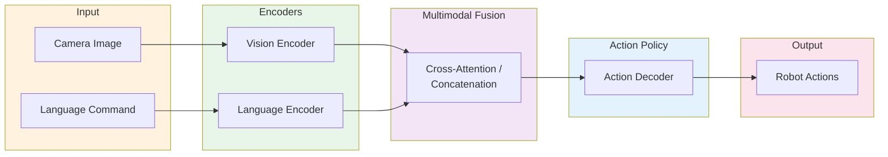
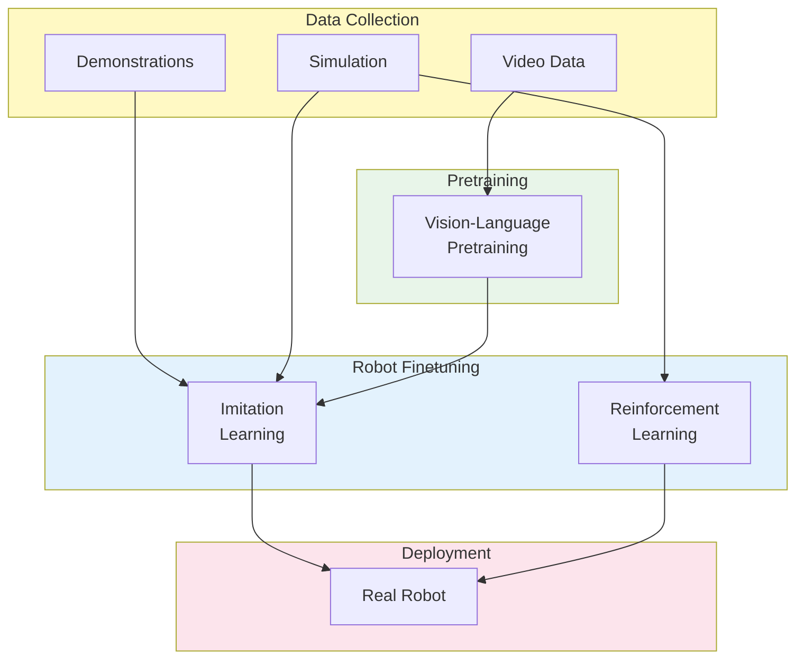

# Chapter 4: Vision–Language–Action (VLA) Systems

## Learning Objectives

By the end of this chapter, you will be able to:

- Define Vision–Language–Action (VLA) systems and explain their significance for robotics
- Describe how foundation models are being adapted for robotic control
- Explain the architecture of VLA models and their key components
- Understand the challenges of grounding language in physical actions
- Identify current VLA research directions and their limitations
- Recognize the potential and current constraints of end-to-end learned robot policies

---

## 1. Introduction to VLA Systems

**Vision–Language–Action (VLA)** systems represent a convergence of computer vision, natural language processing, and robotic control. These systems aim to create robots that can understand visual scenes, interpret natural language instructions, and execute appropriate physical actions.

### The VLA Promise

Traditional robotics relies on task-specific programming: engineers write code for each behavior a robot must perform. VLA systems promise a different paradigm—robots that can:

- Understand open-ended natural language commands
- Generalize to novel objects and situations
- Learn new tasks from demonstrations or descriptions
- Reason about complex, multi-step activities

### Why VLA Now?

Several advances have converged to make VLA systems feasible:

1. **Foundation models**: Large pretrained models provide rich visual and linguistic understanding
2. **Scaling laws**: Larger models and more data yield better generalization
3. **Simulation advances**: Synthetic data enables training at scale
4. **Hardware improvements**: Faster inference enables real-time control

---

## 2. Foundation Models for Robotics

**Foundation models** are large neural networks trained on vast datasets that can be adapted to many downstream tasks. In robotics, they provide:

### 2.1 Visual Understanding

Vision foundation models like **CLIP**, **DINOv2**, and **SAM** provide:
- Object recognition and segmentation
- Scene understanding
- Spatial relationship reasoning
- Zero-shot generalization to new objects

### 2.2 Language Understanding

Large language models (LLMs) contribute:
- Natural language instruction parsing
- Task decomposition and planning
- Commonsense reasoning about the physical world
- Multi-step procedure generation

### 2.3 Vision-Language Integration

**Vision-Language Models (VLMs)** combine both modalities:
- Map images and text to shared representations
- Answer questions about visual scenes
- Generate descriptions of images
- Ground language in visual observations

Examples include:
- **CLIP**: Contrastive learning of image-text pairs
- **LLaVA**: Large language and vision assistant
- **GPT-4V**: Multimodal GPT with vision capabilities
- **Gemini**: Google's multimodal foundation model

---

## 3. VLA Architecture

A typical VLA system integrates perception, language understanding, and action generation into a unified architecture.

### 3.1 System Components

### 3.2 Vision Encoder

Processes raw camera images into meaningful representations:
- Pretrained vision transformers (ViT)
- Convolutional neural networks (ResNet, EfficientNet)
- Outputs: feature maps, object embeddings, spatial tokens

### 3.3 Language Encoder

Processes natural language instructions:
- Pretrained language models (BERT, T5, LLaMA)
- Tokenization and embedding
- Outputs: instruction embeddings, semantic representations

### 3.4 Multimodal Fusion

Combines visual and linguistic information:
- **Cross-attention**: Language attends to visual features
- **Concatenation**: Simple feature combination
- **Early fusion**: Combined from initial layers
- **Late fusion**: Combined near output

### 3.5 Action Policy

Generates robot control commands:
- **Discrete actions**: Classification over action primitives
- **Continuous actions**: Regression for joint positions/velocities
- **Trajectory prediction**: Sequence of future actions
- **Diffusion policies**: Generate actions through denoising

---

## 4. Training VLA Models

Training effective VLA models requires large amounts of robot interaction data and careful design decisions.

### 4.1 Data Sources

| Source | Pros | Cons |
|--------|------|------|
| **Human demonstrations** | Natural, diverse behaviors | Expensive to collect |
| **Teleoperation** | Direct robot data | Requires expert operators |
| **Simulation** | Unlimited, cheap, safe | Reality gap |
| **Internet video** | Massive scale | No action labels |
| **Language annotation** | Rich semantic information | Annotation cost |

### 4.2 Learning Approaches

**Imitation learning**: Learn to mimic expert demonstrations
- Behavioral cloning: Supervised learning on state-action pairs
- Inverse reinforcement learning: Infer reward from demonstrations

**Reinforcement learning**: Learn through trial and error
- Requires reward function design
- Sample inefficient but can exceed demonstrations
- Often combined with simulation

**Pretraining + finetuning**: Leverage foundation models
- Start with pretrained vision-language models
- Finetune on robot-specific data
- Benefit from general knowledge

### 4.3 Training Pipeline

---

## 5. Notable VLA Systems

Several research systems have demonstrated VLA capabilities:

### 5.1 RT-1 (Robotics Transformer)

Google's **RT-1** (2022) demonstrated:
- Transformer architecture for robot control
- Trained on 130,000 demonstrations across 700+ tasks
- Real-time control at 3 Hz
- Generalization to new objects and instructions

### 5.2 RT-2 (Vision-Language-Action)

**RT-2** (2023) extended RT-1 by:
- Using pretrained vision-language models (PaLI-X, PaLM-E)
- Representing actions as text tokens
- Emergent reasoning and generalization
- Web-scale knowledge transfer to robotics

### 5.3 OpenVLA

**OpenVLA** provides an open-source VLA model:
- Based on Prismatic VLM architecture
- Trained on Open X-Embodiment dataset
- Designed for community research and extension
- Demonstrates importance of open robotics research

### 5.4 Other Notable Systems

- **PaLM-E**: Embodied multimodal language model
- **VIMA**: Vision-language model for manipulation
- **Octo**: Generalist robot policy
- **π0**: Physical Intelligence's foundation model

---

## 6. Challenges and Limitations

Despite progress, VLA systems face significant challenges:

### 6.1 Grounding Problem

Language must be grounded in physical reality:
- "Pick up the red cup" requires understanding "red," "cup," and "pick up" in the physical context
- Abstract concepts (e.g., "be careful") are difficult to ground
- Spatial relationships require visual-motor coordination

### 6.2 Generalization

Current systems struggle with:
- Novel objects not seen during training
- New environments with different lighting or layouts
- Instructions phrased differently than training data
- Long-horizon tasks requiring many steps

### 6.3 Safety and Reliability

VLA systems can fail unpredictably:
- Language ambiguity leads to unexpected actions
- Visual confusion causes manipulation errors
- No formal safety guarantees
- Difficult to verify or explain behavior

### 6.4 Data Efficiency

Current approaches require massive datasets:
- Millions of demonstrations for robust policies
- Expensive human data collection
- Simulation data may not transfer well
- Few-shot learning remains challenging

### 6.5 Real-Time Performance

Deploying large models on robots:
- Foundation models are computationally expensive
- Real-time control requires low latency
- Edge deployment constraints
- Trade-off between model capability and speed

---

## 7. The Action Representation Problem

How to represent robot actions is a fundamental design choice:

### 7.1 Action Spaces

**Joint positions/velocities**: Direct motor commands
- Pro: Precise, general
- Con: High-dimensional, platform-specific

**End-effector poses**: Cartesian positions and orientations
- Pro: Intuitive, transferable
- Con: Requires inverse kinematics

**Action primitives**: Pre-defined behaviors (grasp, place, push)
- Pro: Robust, interpretable
- Con: Limited flexibility

**Language-as-action**: Actions represented as text tokens
- Pro: Unified with language models
- Con: Discretization, limited precision

### 7.2 Temporal Structure

Actions unfold over time:
- **Single-step**: One action per observation
- **Chunked**: Sequences of actions
- **Trajectory**: Full motion plan
- **Hierarchical**: High-level goals + low-level control

---

## 8. Experimental / Evolving Concepts

### 8.1 World Models for Planning

Learning predictive models of the world:
- Imagine future states before acting
- Plan in imagination space
- Video prediction models as world simulators
- Active area with rapid progress

### 8.2 In-Context Learning for Robots

Adapting to new tasks from examples:
- Few-shot learning from demonstrations
- Task specification through examples
- No retraining required
- Leveraging LLM in-context abilities

### 8.3 Multimodal Foundation Models

Next-generation models integrating:
- Vision, language, audio, touch
- Action generation as a modality
- Embodied reasoning capabilities
- Cross-embodiment transfer (between different robots)

### 8.4 Human-Robot Collaboration

VLA for working alongside humans:
- Understanding human intent
- Shared autonomy systems
- Natural communication during tasks
- Safety in human-proximate operation

---

## 9. Summary and Key Takeaways

Vision–Language–Action systems represent a frontier of Physical AI research:

1. **VLA systems integrate** vision, language, and action into unified models that can follow natural language instructions

2. **Foundation models provide** pretrained visual and linguistic understanding that transfers to robotics

3. **Architecture design** involves vision encoders, language encoders, multimodal fusion, and action policies

4. **Training requires** large datasets from demonstrations, simulation, and internet data

5. **Current challenges include** grounding, generalization, safety, data efficiency, and real-time performance

6. **Action representation** remains an open problem with trade-offs between precision, generality, and learnability

7. **The field is evolving rapidly** with new models, datasets, and techniques emerging frequently

VLA systems point toward a future where robots can be instructed in natural language and generalize to new situations—but significant research challenges remain before this vision is fully realized.

---

## Further Reading

- Brohan, A., et al. (2022). "RT-1: Robotics Transformer for Real-World Control at Scale." *arXiv:2212.06817*.
- Brohan, A., et al. (2023). "RT-2: Vision-Language-Action Models Transfer Web Knowledge to Robotic Control." *arXiv:2307.15818*.
- Open X-Embodiment Collaboration. (2024). "Open X-Embodiment: Robotic Learning Datasets and RT-X Models." *arXiv:2310.08864*.
- Driess, D., et al. (2023). "PaLM-E: An Embodied Multimodal Language Model." *ICML 2023*.
- Kim, M. J., et al. (2024). "OpenVLA: An Open-Source Vision-Language-Action Model." *arXiv:2406.09246*.
